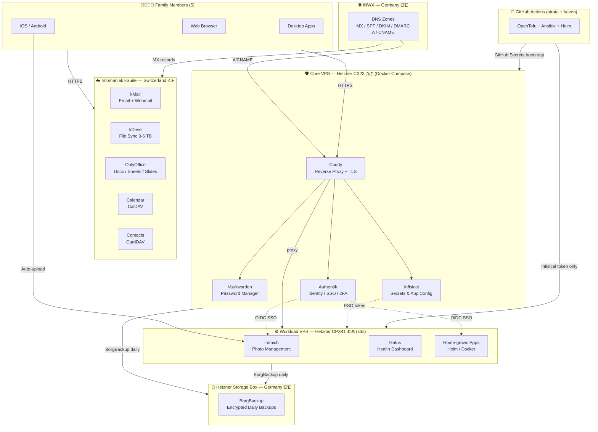

# Hosting Design — Solution A: Infomaniak kSuite + Hetzner VPS

> Decision: Solution A selected (2026-05-26)
> Source: [hosting-solutions.md](hosting-solutions.md) | [hosting.md](hosting.md)
> Scope: 5 users, family platform, EU/Swiss privacy, managed email, self-hosted apps.

---

## Design goal

Simplest day-to-day experience for all 5 family members. A single Swiss vendor (Infomaniak) covers everything the family touches — email, files, docs, calendar, contacts. The VPS is invisible to the family; it runs Immich (photos), Vaultwarden (passwords), Infisical (secrets & config), Authentik (SSO) and home-grown apps.

---

## Architecture



---

## Components

| Layer              | Service                  | Provider                                                          | Purpose                                                                                                                                                                                   |
| ------------------ | ------------------------ | ----------------------------------------------------------------- | ----------------------------------------------------------------------------------------------------------------------------------------------------------------------------------------- |
| Email              | kSuite Mail              | Infomaniak (CH 🇨🇭)                                                 | 5 mailboxes, custom domains, alias forwarding, CalDAV/CardDAV, ActiveSync                                                                                                                 |
| Calendar           | kSuite Calendar          | Infomaniak (CH 🇨🇭)                                                 | Shared family calendars, delegation, CalDAV, iOS/Android sync                                                                                                                             |
| Contacts           | kSuite Contacts          | Infomaniak (CH 🇨🇭)                                                 | CardDAV, vCard import/export, mobile sync                                                                                                                                                 |
| Files              | kDrive                   | Infomaniak (CH 🇨🇭)                                                 | 3–6 TB shared storage, desktop/mobile apps, versioning                                                                                                                                    |
| Docs               | OnlyOffice (via kDrive)  | Infomaniak (CH 🇨🇭)                                                 | Docs/Sheets/Slides in browser                                                                                                                                                             |
| Photos             | Immich                   | Hetzner VPS (DE 🇩🇪)                                                | Timeline, face recognition, shared albums, mobile auto-upload; originals stored on VPS SSD, archived nightly to Storage Box via BorgBackup (Storage Box is backup-only, not a live mount) |
| Passwords          | Vaultwarden              | Hetzner VPS (DE 🇩🇪)                                                | Bitwarden-compatible; same Firefox extension + iPhone app for family                                                                                                                      |
| Secrets & config   | Infisical                | Hetzner VPS (DE 🇩🇪)                                                | Per-app/env secrets + key-value config; CLI/SDK; replaces App Config/Consul                                                                                                               |
| Identity (SSO)     | Authentik                | Hetzner VPS (DE 🇩🇪)                                                | OIDC/OAuth2 for all VPS services; 2FA enforcement; user lifecycle                                                                                                                         |
| Compute — Core     | Docker Compose           | Hetzner CX23 VPS (DE 🇩🇪)                                           | Authentik, Vaultwarden, Infisical, Caddy — stable core; bootstrapped via GitHub Secrets; never experiments run here                                                                       |
| Compute — Workload | k3s (single-node)        | Hetzner CPX41 VPS (DE 🇩🇪)                                          | Immich, Gatus, home-grown apps via Helm; expendable — destroy/rebuild freely; secrets via Infisical token only (External Secrets Operator)                                                |
| IaC — tool         | strata (Python CLI)      | [`huybrechtsxyz/strata`](https://github.com/huybrechtsxyz/strata) | Own Terragrunt alternative; orchestrates OpenTofu + Ansible against `haven` config                                                                                                        |
| IaC — config       | haven (config repo)      | [`huybrechtsxyz/haven`](https://github.com/huybrechtsxyz/haven)   | All infra + app declarations: OpenTofu .tf, Ansible vars, Docker Compose, Helm values                                                                                                     |
| Reverse proxy      | Caddy                    | Hetzner VPS (DE 🇩🇪)                                                | Automatic Let's Encrypt TLS, HSTS, subdomain routing                                                                                                                                      |
| Backups            | BorgBackup → Storage Box | Hetzner (DE 🇩🇪)                                                    | Encrypted daily off-server backups of VPS data; kDrive has 30-day versioning                                                                                                              |
| Monitoring         | Gatus + Healthchecks.io  | Hetzner VPS (DE 🇩🇪) + external                                     | Gatus on VPS: per-service health dashboard; Healthchecks.io (free): BorgBackup dead-man's switch; UptimeRobot: public endpoint availability                                               |
| DNS registration   | INWX                     | INWX (DE 🇩🇪)                                                       | Domain registration for 4 active domains (theorderoftheblacklizard.be decommissioned)                                                                                                     |
| DNS hosting        | INWX built-in NS         | INWX (DE 🇩🇪)                                                       | MX, SPF, DKIM, DMARC, A/CNAME records per domain                                                                                                                                          |

---

## Domain & email layout

```
primary:   huybrechts.xyz              → kSuite MX → 5 mailboxes (one per family member)
alias 1:   huybrechts.dev              → kSuite MX → alias → primary mailboxes
alias 2:   meeus.family                → kSuite MX → alias → primary mailboxes
alias 3:   alderwyn.xyz                → kSuite MX → alias → primary mailboxes
decom:     theorderoftheblacklizard.be → NOT transferred; let expire at current registrar
```

> **Decision: `theorderoftheblacklizard.be` will be decommissioned.** The domain will not be transferred to INWX and will not be renewed. Let it expire at the current registrar. Before expiry, ensure no active email or web traffic depends on it.

All remaining 4 domains are added as **alias domains** in kSuite Mail Service (no limit on linked domains per service). Each domain has its own MX pointing to kSuite, plus its own SPF, DKIM (key generated by kSuite per domain), and DMARC record.

### INWX domain pricing

Prices in EUR/year excl. VAT (as of May 2026):

| Domain                              | TLD       | Register | Renew                   | Transfer | Whois Privacy | Stable price?    |
| ----------------------------------- | --------- | -------- | ----------------------- | -------- | ------------- | ---------------- |
| `huybrechts.xyz`                    | `.xyz`    | ~€24/yr  | ~€24/yr                 | ~€24/yr  | +€5/yr        | ✓ flat           |
| `alderwyn.xyz`                      | `.xyz`    | ~€24/yr  | ~€24/yr                 | ~€24/yr  | +€5/yr        | ✓ flat           |
| `huybrechts.dev`                    | `.dev`    | ~€11 Y1¹ | ~€18/yr                 | ~€18/yr  | +€5/yr        | ⚠ Y1 promo       |
| `meeus.family`                      | `.family` | ~€7 Y1¹  | ~€52/yr                 | ~€52/yr  | +€5/yr        | ⚠ big jump       |
| ~~`theorderoftheblacklizard.be`~~   | ~~`.be`~~ | —        | —                       | —        | —             | ✗ decommissioned |
| **Total (steady-state, 4 domains)** |           |          | **~€76/yr (~€6.30/mo)** |          |               |                  |

¹ Promo prices are first-year only (promo valid until 01.07.2026). Renewal is at full price from year 2.

> **⚠️ TODO — `meeus.family`:** renewal jumps to ~€52/yr from year 2. **Decide before first renewal whether to keep this domain.** Check if any family members actively use `@meeus.family` addresses. If not widely used, drop it and redirect to `@huybrechts.xyz` equivalents — saves ~€52/yr.

> **Note on `.dev`:** all `.dev` domains are HSTS-preloaded by Google's registry — HTTPS is mandatory (HTTP requests are refused by browsers before reaching the server). Caddy handles this automatically via auto-TLS; no manual HSTS configuration is needed.

---

### Mailboxes & groups

#### Personal mailboxes (5)

One kSuite mailbox per family member on `huybrechts.xyz`:

| Mailbox                  | Member | Notes                 |
| ------------------------ | ------ | --------------------- |
| `parent1@huybrechts.xyz` | Parent |                       |
| `parent2@huybrechts.xyz` | Parent |                       |
| `kid1@huybrechts.xyz`    | Child  | forwarded (see below) |
| `kid2@huybrechts.xyz`    | Child  | forwarded (see below) |
| `kid3@huybrechts.xyz`    | Child  | forwarded (see below) |

> Replace placeholder names above with real addresses once mailboxes are provisioned.

#### Distribution groups

Group addresses are configured in **kSuite Mail Service → Distribution lists** (no extra mailbox licence needed). Each group address fans out to its members.

| Group address                 | Members                             | Purpose                            |
| ----------------------------- | ----------------------------------- | ---------------------------------- |
| `family@huybrechts.xyz`       | all 5 mailboxes                     | Family-wide announcements / shared |
| *(add more groups as needed)* | *(e.g. parents only, kids only, …)* |                                    |

#### Parental oversight — child mail forwarding

Each child's mailbox has a server-side **keep copy + forward** rule so the parents receive a copy of every incoming message without removing it from the child's inbox.

Configured in: **kSuite Manager → Mail Service → [child mailbox] → Redirections / Forwarding**

| Child mailbox         | Forward copy to                                    |
| --------------------- | -------------------------------------------------- |
| `kid1@huybrechts.xyz` | `parent1@huybrechts.xyz`, `parent2@huybrechts.xyz` |
| `kid2@huybrechts.xyz` | `parent1@huybrechts.xyz`, `parent2@huybrechts.xyz` |
| `kid3@huybrechts.xyz` | `parent1@huybrechts.xyz`, `parent2@huybrechts.xyz` |

The same **keep copy + forward** rule can be applied to any distribution group address (e.g. a `kids@huybrechts.xyz` group) so that mail sent to the group also lands in the parents' inboxes.

---

## VPS specification

Two-node architecture: a stable **Core VPS** (never touched once running) and an expendable **Workload VPS** (tinker freely).

### Infrastructure as code

All compute is managed as code — no manual ClickOps.

| Tool       | Role                                                                                                                                | Repo                                                              |
| ---------- | ----------------------------------------------------------------------------------------------------------------------------------- | ----------------------------------------------------------------- |
| **strata** | Python CLI tool — own alternative to Terragrunt. Orchestrates OpenTofu + Ansible + Helm runs against `haven` config                 | [`huybrechtsxyz/strata`](https://github.com/huybrechtsxyz/strata) |
| **haven**  | Config repository — YAML-based declarations of all infra and apps (OpenTofu `.tf`, Ansible vars, Docker Compose files, Helm values) | [`huybrechtsxyz/haven`](https://github.com/huybrechtsxyz/haven)   |

- **`strata`** — the tool (Python executable). Reads `haven`, drives OpenTofu for provisioning (VPS, Storage Box, firewall, DNS zones) and Ansible for OS hardening + service bootstrap, and Helm for k3s workload deployments.
- **`haven`** — the config (data). Contains all YAML/HCL/Compose/Helm files that describe what to provision and how to configure it. No logic — only declarations. `strata` consumes it.

---

### Node 1 — Core VPS (Docker Compose) 🛡️

Runs the identity and secrets infrastructure. Boring by design — deployed once, never used as a playground. If this node is healthy, you can always recover everything else.

| Spec          | Value                                                                       |
| ------------- | --------------------------------------------------------------------------- |
| Model         | Hetzner CX23                                                                |
| vCPU          | 2                                                                           |
| RAM           | 4 GB                                                                        |
| SSD           | 40 GB                                                                       |
| Network       | 20 TB/mo included                                                           |
| Orchestration | Docker Compose + systemd                                                    |
| Services      | Caddy, Authentik, Vaultwarden, Infisical                                    |
| Cost          | ~€4/mo                                                                      |
| IaC secrets   | **GitHub Secrets** (bootstrap only — acceptable; Infisical not running yet) |
| Skill req.    | Docker Compose, basic Linux                                                 |

**Bootstrap sequence:**
1. GitHub Actions uses GitHub Secrets (Hetzner API key, SSH key) to provision the CX23 via OpenTofu and run Ansible
2. Ansible deploys Docker Compose stack: Caddy → Infisical → Authentik → Vaultwarden
3. After Infisical is running, all subsequent deployments pull secrets from Infisical — GitHub Secrets no longer needed at runtime

---

### Node 2 — Workload VPS (k3s) ⚙️

Runs all family apps. Can be destroyed and rebuilt at any time without affecting core auth or passwords. Extends easily — add a Helm chart, deploy a new app, break things, rebuild.

| Spec          | Value                                                                                        |
| ------------- | -------------------------------------------------------------------------------------------- |
| Model         | Hetzner CPX41                                                                                |
| vCPU          | 8                                                                                            |
| RAM           | 16 GB                                                                                        |
| SSD           | 240 GB                                                                                       |
| Network       | 20 TB/mo included                                                                            |
| Orchestration | k3s (single-node) + Helm + External Secrets Operator + cert-manager                          |
| Services      | Immich, Gatus, home-grown apps, future apps                                                  |
| Cost          | ~€26/mo                                                                                      |
| IaC secrets   | **Infisical token only** — no GitHub Secrets; ESO pulls all secrets at runtime from Core VPS |
| Skill req.    | kubectl, Helm, k3s administration                                                            |

**Secrets flow on Workload VPS:**
- GitHub Actions passes a single short-lived Infisical machine token to the k3s deployment
- External Secrets Operator (ESO) uses that token to fetch all app secrets from Infisical at runtime
- No secrets stored in git, no GitHub Secrets in workload pipelines, no plain env files

| Comparison point | Core VPS (Docker Compose)                   | Workload VPS (k3s)               |
| ---------------- | ------------------------------------------- | -------------------------------- |
| Services         | Caddy, Authentik, Vaultwarden, Infisical    | Immich, Gatus, apps              |
| Stability goal   | Never breaks                                | Expendable — rebuild freely      |
| Secrets source   | GitHub Secrets (bootstrap only) → Infisical | Infisical token only (ESO)       |
| Upgrade strategy | `docker compose pull && up -d`              | `helm upgrade`, rolling restarts |
| Rollback         | Manual (image tags in Compose)              | `helm rollback`                  |
| Multi-node later | n/a                                         | Easy — add CPX31 worker node     |
| Cert management  | Caddy auto-TLS                              | cert-manager + Let's Encrypt     |
| Cost             | ~€4/mo                                      | ~€26/mo                          |

> **Decision:** two-node split. Core VPS (CX23, Docker Compose) is the trust anchor — stable, minimal, never an experiment. Workload VPS (CPX41, k3s) is the platform — extend it, break it, rebuild it freely. The k3s node only needs an Infisical token; it has no knowledge of Hetzner API keys, SSH keys, or admin credentials.

---

## Security posture

| Layer             | Controls                                                                                                                                                                                                                                               |
| ----------------- | ------------------------------------------------------------------------------------------------------------------------------------------------------------------------------------------------------------------------------------------------------ |
| kSuite            | Swiss nFADP + GDPR, DPA, TLS in transit, encrypted at rest, DKIM/DMARC managed; ⚠ no independent backup of kSuite data — relies on Infomaniak redundancy + 30-day kDrive versioning; consider periodic IMAP/CardDAV/CalDAV export to VPS for cold copy |
| VPS OS            | UFW (80/443/SSH only), SSH key-only, Fail2Ban, unattended-upgrades                                                                                                                                                                                     |
| Caddy             | Auto HTTPS, HSTS, TLS 1.2/1.3 only, HTTP/2                                                                                                                                                                                                             |
| Authentik         | 2FA enforced (TOTP/WebAuthn), OIDC provider for all services, daily encrypted DB backup                                                                                                                                                                |
| Vaultwarden       | HTTPS only, OIDC login via Authentik, admin token protected, daily backup                                                                                                                                                                              |
| Immich            | OIDC login via Authentik, not exposed without auth; originals on VPS SSD, nightly BorgBackup to Storage Box                                                                                                                                            |
| Infisical         | Runs on Core VPS; admin UI behind Caddy + Authentik SSO (admin-only); API internal to Core VPS; secrets never in plain env files or git; Workload VPS accesses via ESO token scoped to its own namespace                                               |
| Container updates | Core VPS: image tags pinned in `haven`; `docker compose pull && up -d`; monthly review. Workload VPS: Helm versions pinned in `haven`; `helm upgrade`; Dependabot on `haven` for digest updates                                                        |
| IaC secrets       | Core bootstrap: GitHub Secrets (Hetzner API key, SSH key) — one-time only; runtime uses Infisical. Workload VPS: Infisical ESO token only — no other secrets in workload pipelines                                                                     |
| Monitoring        | Gatus (VPS) for per-service health; Healthchecks.io for BorgBackup dead-man's switch; UptimeRobot for external endpoint pings                                                                                                                          |
| Backups           | BorgBackup with encryption key stored in Vaultwarden; daily to Storage Box; restore tested monthly; ⚠ VPS + Storage Box are same Hetzner region — consider cold copy to Backblaze B2/Wasabi for DR                                                     |

---

## Monthly cost

| Item                                         | Cost           |
| -------------------------------------------- | -------------- |
| Infomaniak kSuite (5 users, kDrive 3 TB)     | ~€25-35/mo     |
| Infomaniak kDrive extra storage (to ~5 TB)   | ~€5-10/mo      |
| Hetzner CX23 VPS (Core — Docker Compose)     | ~€4/mo         |
| Hetzner CPX41 VPS (Workload — k3s)           | ~€26/mo        |
| Hetzner BX11 Storage Box (1 TB)              | ~€4/mo         |
| Domains (4 × INWX, steady-state)             | ~€6.30/mo      |
| Vaultwarden / Infisical / Immich / Authentik | €0 (on VPS)    |
| **Total**                                    | **~€64-80/mo** |
| **Current spend**                            | ~€58-81/mo     |

Savings: Bitwarden Team (~€15/mo) eliminated. 2 extra users added vs current Google Workspace (3 → 5). Swiss privacy. No MTA ops.

---

## Key decisions

| Decision                          | Rationale                                                                                                                                                                                  |
| --------------------------------- | ------------------------------------------------------------------------------------------------------------------------------------------------------------------------------------------ |
| kSuite over Proton                | CalDAV/CardDAV native; no Proton Bridge needed; simplest family UX                                                                                                                         |
| kSuite over Mailbox.org           | Single-vendor for mail+files+docs; less VPS admin (no Nextcloud)                                                                                                                           |
| INWX over Versio/ClouDNS          | German GDPR registrar; clean API; no extra ClouDNS subscription                                                                                                                            |
| Vaultwarden over Bitwarden        | Same UX, €15/mo saving, data in EU, full control                                                                                                                                           |
| Infisical over Vault/Consul       | MIT licence, no IBM/BSL risk, covers secrets + config in one tool                                                                                                                          |
| Authentik over Keycloak           | Lighter (300-500 MB vs 1-2 GB), MIT, excellent UI, proxy provider                                                                                                                          |
| BorgBackup over restic            | Mature, deduplication, encryption built-in, Hetzner Storage Box native                                                                                                                     |
| Two-node split (Core + Workload)  | Core VPS (CX23, Docker Compose) is the trust anchor — Authentik, Vaultwarden, Infisical never disrupted by experiments; Workload VPS (CPX41, k3s) is expendable — break and rebuild freely |
| k3s for workload                  | Helm-native upgrades, rollback, ESO secrets integration; easy to add worker nodes; family-5 apps fit comfortably on CPX41                                                                  |
| GitHub Secrets for Core bootstrap | Chicken-and-egg: Infisical not running yet during first deploy; acceptable for one-time bootstrap only; runtime uses Infisical                                                             |
| Infisical token only for Workload | k3s node has no Hetzner API key, SSH key, or admin credentials — only an ESO token scoped to its own secrets namespace                                                                     |
| strata over Terragrunt            | strata is own Python CLI purpose-built for this workflow; no HCL wrapper overhead, full control                                                                                            |
| .be domain decommissioned         | theorderoftheblacklizard.be not transferred; low/no usage, avoids €10/yr + operational overhead                                                                                            |

---

## Risks & mitigations

| Risk                                                  | Impact | Mitigation                                                                                                   |
| ----------------------------------------------------- | ------ | ------------------------------------------------------------------------------------------------------------ |
| Infomaniak outage (mail/files)                        | High   | kDrive has 30-day versioning; email is SaaS-HA; standard protocols allow emergency IMAP pull                 |
| kSuite data loss (no independent backup)              | Medium | Infomaniak has internal redundancy; mitigate with periodic IMAP/CalDAV/WebDAV export to VPS or cold storage  |
| VPS failure (photos/passwords)                        | High   | Daily encrypted BorgBackup to Storage Box; restore tested monthly                                            |
| Hetzner regional incident (VPS + Storage Box same DC) | Medium | Both VPS and backup in same region; mitigate with cold copy to Backblaze B2 or Wasabi (~€2/mo for 100 GB)    |
| Infomaniak changes pricing or terms                   | Medium | Standard protocols (IMAP/CalDAV/CardDAV) — migrate to Mailbox.org/Proton                                     |
| Admin unavailable (bus factor = 1)                    | Medium | All procedures in hosting-steps.md; emergency Vaultwarden admin token shared with trusted person; IaC in git |
| Authentik compromise (SSO for all apps)               | High   | 2FA enforced; daily DB backup; OIDC client secrets in Infisical; Authentik has no Caddy bypass               |
| BorgBackup silently fails                             | High   | Healthchecks.io dead-man's switch; Gatus monitors backup job exit codes                                      |
| Domain registrar issues                               | Low    | INWX is ICANN-accredited; EPP transfer out always possible                                                   |

---

## Future considerations

- **Add CPX31 worker node** to k3s if Workload VPS RAM becomes the bottleneck (easy — k3s designed for this).
- **Add Flagsmith** if feature-flag rollout percentages or A/B testing are needed beyond Infisical boolean config.
- **Tailscale mesh** for admin-only VPS access (SSH + Infisical API) without public exposure; replaces UFW SSH exception for admin sessions.
- **Promote Core VPS to HA** (second CX23 + keepalived) if uptime SLA becomes critical.
- **Nextcloud** on Workload VPS only if kDrive becomes insufficient for power-user file workflows.

---

## haven configuration reference

> This section contains the exact values needed to create every `haven` YAML file for this platform. Each subsection maps to one file. All files use `apiVersion: platform.huybrechts.xyz/v1`.

---

### `stack/dc-eu-central.yaml` — provider

```yaml
kind: provider
meta:
  name: hetzner_eu_central
  annotations:
    description: Hetzner Cloud — EU Central (Nuremberg / Falkenstein)
  tags: [haven, hetzner, provider]
spec:
  properties:
    type: hetzner
    region: eu-central   # nbg1 (Nuremberg) preferred; fsn1 (Falkenstein) fallback
```

---

### `stack/vm-core.yaml` — Core VPS resource

```yaml
kind: resource
meta:
  name: haven_vm_core
  annotations:
    description: Hetzner CX23 — Core VPS (Caddy, Authentik, Vaultwarden, Infisical)
  tags: [haven, vm, core]
spec:
  properties:
    provider_type: hetzner
    resource_type: virtualmachine
    unit_cost: 4.00   # EUR per month
  configuration:
    os_name: "Ubuntu"
    os_code: "24.04 LTS"
    cpu_cores: 2
    ram_mb: 4096
    billing: monthly
    disk_size: 40
  storage:
    install_path: /opt/haven
    volumes:
      - name: config   path: /opt/haven/etc
      - name: data     path: /opt/haven/var/data
      - name: logs     path: /opt/haven/var/logs
      - name: certs    path: /opt/haven/var/certs    # Caddy ACME storage
```

---

### `stack/vm-workload.yaml` — Workload VPS resource

```yaml
kind: resource
meta:
  name: haven_vm_workload
  annotations:
    description: Hetzner CPX41 — Workload VPS (k3s; Immich, Gatus, apps)
  tags: [haven, vm, workload]
spec:
  properties:
    provider_type: hetzner
    resource_type: virtualmachine
    unit_cost: 26.00   # EUR per month
  configuration:
    os_name: "Ubuntu"
    os_code: "24.04 LTS"
    cpu_cores: 8
    ram_mb: 16384
    billing: monthly
    disk_size: 240
  storage:
    install_path: /opt/haven
    volumes:
      - name: immich-data   path: /opt/haven/var/immich       # photo originals
      - name: k3s-data      path: /var/lib/rancher/k3s
      - name: logs          path: /opt/haven/var/logs
```

---

### `stack/fw-core.yaml` — Core VPS firewall

```yaml
kind: firewall
meta:
  name: haven_fw_core
  annotations:
    description: Firewall for Core VPS — public HTTPS only; SSH from private network
  tags: [haven, firewall, core]
spec:
  reset: true
  defaults:
    - direction: in   permission: deny   comment: Deny all inbound
    - direction: out  permission: deny   comment: Deny all outbound
  allow:
    # Essential
    - direction: out  proto: udp  port: 53       comment: DNS
    - direction: out  proto: tcp  port: 53       comment: DNS TCP
    - direction: out  proto: udp  port: 123      comment: NTP
    - direction: in   interface: lo              comment: Loopback IN
    - direction: out  interface: lo              comment: Loopback OUT
    # Public ingress
    - direction: in   proto: tcp  port: 80       comment: HTTP (redirect to HTTPS)
    - direction: in   proto: tcp  port: 443      comment: HTTPS
    - direction: out  proto: tcp  port: 80       comment: HTTP out
    - direction: out  proto: tcp  port: 443      comment: HTTPS out
    # SSH — restricted to Hetzner private network or Tailscale CGNAT
    - direction: in   proto: tcp  port: 22       from: 10.0.0.0/8   comment: SSH (private only)
    # Internal — Core→Workload (Infisical API)
    - direction: out  proto: tcp  port: 8080     comment: Infisical internal API to workload
```

---

### `stack/fw-workload.yaml` — Workload VPS firewall

```yaml
kind: firewall
meta:
  name: haven_fw_workload
  annotations:
    description: Firewall for Workload VPS — proxied behind Core Caddy; SSH private only
  tags: [haven, firewall, workload]
spec:
  reset: true
  defaults:
    - direction: in   permission: deny
    - direction: out  permission: deny
  allow:
    - direction: out  proto: udp  port: 53       comment: DNS
    - direction: out  proto: tcp  port: 53       comment: DNS TCP
    - direction: out  proto: udp  port: 123      comment: NTP
    - direction: in   interface: lo              comment: Loopback IN
    - direction: out  interface: lo              comment: Loopback OUT
    - direction: out  proto: tcp  port: 80       comment: HTTP out (image pulls)
    - direction: out  proto: tcp  port: 443      comment: HTTPS out
    # From Core Caddy proxy only
    - direction: in   proto: tcp  port: 80       from: <CORE_VPS_IP>   comment: Proxy from Core
    - direction: in   proto: tcp  port: 443      from: <CORE_VPS_IP>   comment: Proxy from Core
    - direction: in   proto: tcp  port: 22       from: 10.0.0.0/8      comment: SSH private only
    # k3s API server (admin kubectl)
    - direction: in   proto: tcp  port: 6443     from: 10.0.0.0/8      comment: k3s API private only
```

---

### `apps/mod-caddy.yaml` — Caddy module (Core VPS)

```yaml
kind: module
meta:
  name: haven_caddy
  annotations:
    description: Caddy reverse proxy — auto TLS, HSTS, subdomain routing
  tags: [haven, caddy, core]
spec:
  source:
    repository: haven
    source_path: services/caddy
  properties:
    image: caddy:2-alpine
    mounts:
      - name: config    type: config   target_path: /etc/caddy
      - name: certs     type: data     target_path: /data/caddy
      - name: logs      type: logs     target_path: /var/log/caddy
  checks:
    - name: caddy_health   type: http   endpoint: http://localhost:2019/metrics   interval: 30s
  endpoints:
    - name: https_entry    url: https://huybrechts.xyz   description: Public entry point
```

---

### `apps/mod-authentik.yaml` — Authentik module (Core VPS)

```yaml
kind: module
meta:
  name: haven_authentik
  annotations:
    description: Authentik — Identity provider, SSO, 2FA for all services
  tags: [haven, authentik, core]
spec:
  source:
    repository: haven
    source_path: services/authentik
  properties:
    image: ghcr.io/goauthentik/server:2024.x
    mounts:
      - name: media     type: data    target_path: /media
      - name: certs     type: config  target_path: /certs
      - name: logs      type: logs    target_path: /var/log/authentik
  checks:
    - name: authentik_health   type: http   endpoint: http://localhost:9000/-/health/ready/   interval: 30s
  endpoints:
    - name: sso_ui   url: https://auth.huybrechts.xyz   description: Authentik admin UI and SSO login
  oidc_clients:            # fill in client IDs after first deploy
    - name: vaultwarden    client_id: ""
    - name: immich         client_id: ""
    - name: infisical      client_id: ""
```

---

### `apps/mod-vaultwarden.yaml` — Vaultwarden module (Core VPS)

```yaml
kind: module
meta:
  name: haven_vaultwarden
  annotations:
    description: Vaultwarden — Bitwarden-compatible password manager
  tags: [haven, vaultwarden, core]
spec:
  source:
    repository: haven
    source_path: services/vaultwarden
  properties:
    image: vaultwarden/server:latest
    mounts:
      - name: data   type: data   target_path: /data
  checks:
    - name: vaultwarden_health   type: http   endpoint: http://localhost:80/alive   interval: 30s
  endpoints:
    - name: vault_ui   url: https://vault.huybrechts.xyz   description: Vaultwarden web UI
```

---

### `apps/mod-infisical.yaml` — Infisical module (Core VPS)

```yaml
kind: module
meta:
  name: haven_infisical
  annotations:
    description: Infisical — secrets management and app config (ESO source for Workload VPS)
  tags: [haven, infisical, core]
spec:
  source:
    repository: haven
    source_path: services/infisical
  properties:
    image: infisical/infisical:latest
    mounts:
      - name: data   type: data   target_path: /app/data
      - name: logs   type: logs   target_path: /var/log/infisical
  checks:
    - name: infisical_health   type: http   endpoint: http://localhost:8080/api/status   interval: 30s
  endpoints:
    - name: secrets_ui    url: https://secrets.huybrechts.xyz   description: Infisical admin UI (Authentik SSO only)
    - name: internal_api  url: http://infisical:8080             description: Internal API for ESO on Workload VPS
```

---

### `apps/mod-immich.yaml` — Immich module (Workload VPS / k3s)

```yaml
kind: module
meta:
  name: haven_immich
  annotations:
    description: Immich — self-hosted photo and video management
  tags: [haven, immich, workload]
spec:
  source:
    repository: haven
    source_path: services/immich
  properties:
    image: ghcr.io/immich-app/immich-server:release
    helm_chart: immich/immich   # if Helm path used on k3s
    mounts:
      - name: library   type: data   target_path: /usr/src/app/upload   description: Photo originals on VPS SSD
      - name: logs      type: logs   target_path: /var/log/immich
  checks:
    - name: immich_health   type: http   endpoint: http://localhost:2283/api/server-info/ping   interval: 30s
  endpoints:
    - name: photos_ui   url: https://photos.huybrechts.xyz   description: Immich web UI
```

---

### `apps/mod-gatus.yaml` — Gatus module (Workload VPS / k3s)

```yaml
kind: module
meta:
  name: haven_gatus
  annotations:
    description: Gatus — self-hosted service health dashboard
  tags: [haven, gatus, workload]
spec:
  source:
    repository: haven
    source_path: services/gatus
  properties:
    image: twinproduction/gatus:latest
    mounts:
      - name: config   type: config   target_path: /config
  checks:
    - name: gatus_self   type: http   endpoint: http://localhost:8080/health   interval: 30s
  endpoints:
    - name: status_ui   url: https://status.huybrechts.xyz   description: Public status page
```

---

### `stack/ns-core.yaml` — Core namespace

```yaml
kind: namespace
meta:
  name: haven_ns_core
  annotations:
    description: Core infrastructure namespace — identity, secrets, passwords, proxy
  tags: [haven, namespace, core]
spec:
  modules:
    - name: caddy          file: apps/mod-caddy.yaml
    - name: authentik      file: apps/mod-authentik.yaml
    - name: vaultwarden    file: apps/mod-vaultwarden.yaml
    - name: infisical      file: apps/mod-infisical.yaml
```

---

### `stack/ns-workload.yaml` — Workload namespace

```yaml
kind: namespace
meta:
  name: haven_ns_workload
  annotations:
    description: Workload namespace — family apps on k3s
  tags: [haven, namespace, workload]
spec:
  modules:
    - name: immich   file: apps/mod-immich.yaml
    - name: gatus    file: apps/mod-gatus.yaml
```

---

### `stack/ws-family.yaml` — Workspace

```yaml
kind: workspace
meta:
  name: haven_family
  annotations:
    description: Family platform workspace — Core VPS (Docker Compose) + Workload VPS (k3s)
  tags: [haven, platform]
spec:
  providers:
    - name: hetzner_eu_central   file: stack/dc-eu-central.yaml
  provisioners:
    - name: haven_iac   provisioner: terraform   source: { repository: haven, source_path: terraform }
  topology:
    - name: core_node
      provider: hetzner_eu_central
      provisioner: terraform
      type: single_node          # Docker Compose — no cluster
      volumes: [config, data, logs, certs]
      components:
        - resource: haven_vm_core
    - name: workload_node
      provider: hetzner_eu_central
      provisioner: terraform
      type: k3s_single           # k3s single-node
      volumes: [immich-data, k3s-data, logs]
      components:
        - resource: haven_vm_workload
  resources:
    - name: haven_vm_core       file: stack/vm-core.yaml      role: core
      firewalls: [haven_fw_core]
    - name: haven_vm_workload   file: stack/vm-workload.yaml  role: workload
      firewalls: [haven_fw_workload]
  namespaces:
    - name: haven_ns_core       file: stack/ns-core.yaml
    - name: haven_ns_workload   file: stack/ns-workload.yaml
  firewalls:
    - name: haven_fw_core       file: stack/fw-core.yaml
    - name: haven_fw_workload   file: stack/fw-workload.yaml
```

---

### `deploy/deploy-prd.yaml` — Production deployment

```yaml
kind: deployment
meta:
  name: haven_deploy_prd
  annotations:
    description: Production deployment — family platform on Hetzner
  tags: [haven, production]
spec:
  layers:
    environment: prd
  properties:
    environment: prd
  workspace:
    name: haven_family
    file: stack/ws-family.yaml
  environments:
    - envs/env-prd.yaml
  stages:
    - name: infrastructure   type: infrastructure   scope: all         depends_on: null        on_failure: stop
    - name: core_bootstrap   type: configuration    scope: core_node   depends_on: infrastructure   on_failure: stop
    - name: workload_deploy  type: configuration    scope: workload_node   depends_on: core_bootstrap   on_failure: stop
```

---

### `envs/env-prd.yaml` — Environment values

```yaml
kind: environment
meta:
  name: haven_env_prd
  tags: [haven, prd]
spec:
  properties:
    environment: prd
  variables:
    # DNS
    DOMAIN_PRIMARY:   huybrechts.xyz
    DOMAIN_ALIAS_1:   huybrechts.dev
    DOMAIN_ALIAS_2:   alderwyn.xyz
    DOMAIN_ALIAS_3:   madebyjana.be
    # Subdomains (all A records on Core VPS IP)
    SUBDOMAIN_AUTH:     auth.huybrechts.xyz
    SUBDOMAIN_VAULT:    vault.huybrechts.xyz
    SUBDOMAIN_SECRETS:  secrets.huybrechts.xyz
    SUBDOMAIN_PHOTOS:   photos.huybrechts.xyz
    SUBDOMAIN_STATUS:   status.huybrechts.xyz
    # Infrastructure
    HETZNER_REGION:     eu-central
    CORE_VM_TYPE:       cx23
    WORKLOAD_VM_TYPE:   cpx41
    STORAGE_BOX_TYPE:   bx11
    # Secrets — all values stored in Infisical (not here)
    # Bootstrap only: loaded from GitHub Secrets on first deploy
    # HETZNER_API_TOKEN:  → GitHub Secret: HETZNER_API_TOKEN
    # SSH_PUBLIC_KEY:     → GitHub Secret: SSH_PUBLIC_KEY
    # Runtime secrets (post-bootstrap): pulled via Infisical ESO
```

---

## Migration scope

Data that must be migrated or bootstrapped before decommissioning Google Workspace and Kamatera VPS:

- **Email history** — export from Gmail (Google Takeout MBOX) → import into kSuite via IMAP migration tool
- **Contacts** — export from Google Contacts (vCard) → import into kSuite Contacts
- **Calendar** — export from Google Calendar (ICS) → import into kSuite Calendar
- **Files** — export from Google Drive → upload to kDrive (desktop sync client)
- **Photos** — migrate from Google Photos → ingest into Immich (mobile app + web upload)
- **Passwords** — export from Bitwarden (JSON/CSV) → import into Vaultwarden (same format)
- **DNS** — transfer 3 domains from Versio → INWX; update NS/MX records; verify email flow before cutover
- **VPS workloads** — re-deploy from Kamatera → Hetzner via `strata` + `haven` (no lift-and-shift; rebuild from IaC)
- **Secrets** — seed Infisical with all service credentials during VPS bootstrap

> Detailed step-by-step sequence and cutover order in [hosting-steps.md](hosting-steps.md).

---

*Next: [hosting-steps.md](hosting-steps.md) — end-to-end migration plan.*
