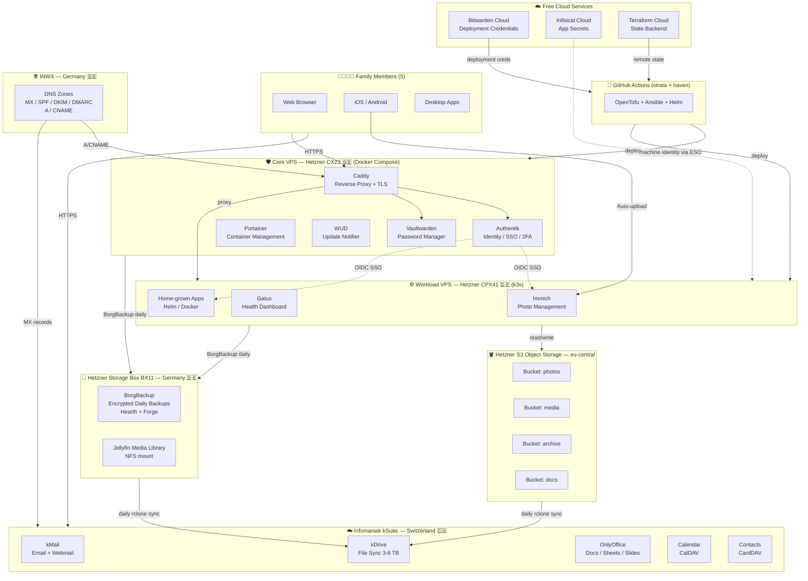

# Haven Architecture Reference

> Shared architecture documentation used by design.md and guide.md

This document describes the Haven platform infrastructure, components, and data flow. It serves as the single source of truth for:

- System topology (Hearth + Forge + storage)
- Component inventory and responsibilities
- Data durability strategy
- Provider landscape

For design rationale and decisions, see [design.md](design.md).
For deployment instructions, see [guide.md](guide.md).

---

## System Overview

Haven is a two-node family platform on Hetzner with Swiss-based file services:

```text
haven (workspace)
├── hearth (VPS — Docker Compose)          ← Core: Authentik, Vaultwarden, Caddy
│   ├── Caddy          — reverse proxy + auto-TLS
│   ├── Authentik      — SSO / identity    → auth.{domain}
│   ├── Vaultwarden    — passwords         → vault.{domain}
│   ├── Portainer      — container mgmt    → portainer.{domain}
│   └── WUD            — update notifier   → wud.{domain}
│
├── forge (VPS — k3s)                      ← Workload: Immich, Jellyfin, Gatus, apps
│   ├── Immich         — photo library     → photos.{domain}
│   ├── Jellyfin       — media streaming   → jellyfin.{domain} (TBD)
│   ├── Gatus          — health dashboard  → status.{domain}
│   └── Apps           — home-grown        → custom subdomains
│
├── storage box (BX11, 1 TB)               ← Off-site backups + media archive
│   ├── BorgBackup repo (daily, encrypted)
│   └── NFS mount (/mnt/storagebox)        ← Jellyfin media library
│
├── object storage (S3, eu-central)        ← Immich originals + media overflow
│   ├── haven-photos   — Immich library
│   ├── haven-media    — media overflow
│   ├── haven-archive  — cold storage
│   └── haven-docs     — documentation
│
└── cloud services (free tier)             ← Bootstrap + secrets + state
    ├── Bitwarden Cloud  — deployment credentials (API keys, SSH keys)
    ├── Infisical Cloud  — runtime application secrets
    ├── Terraform Cloud  — remote state backend
    └── GitHub           — repo + GitHub Actions CI/CD
```

---

## Architecture Diagram



---

## Component Inventory

| Layer               | Service                   | Provider                                                          | Purpose                                                                                                                                                                                                                                                                                          |
| ------------------- | ------------------------- | ----------------------------------------------------------------- | ------------------------------------------------------------------------------------------------------------------------------------------------------------------------------------------------------------------------------------------------------------------------------------------------ |
| Email               | kSuite Mail               | Infomaniak (CH 🇨🇭)                                                 | 5 mailboxes, custom domains, alias forwarding, CalDAV/CardDAV, ActiveSync                                                                                                                                                                                                                        |
| Calendar            | kSuite Calendar           | Infomaniak (CH 🇨🇭)                                                 | Shared family calendars, delegation, CalDAV, iOS/Android sync                                                                                                                                                                                                                                    |
| Contacts            | kSuite Contacts           | Infomaniak (CH 🇨🇭)                                                 | CardDAV, vCard import/export, mobile sync                                                                                                                                                                                                                                                        |
| Files               | kDrive                    | Infomaniak (CH 🇨🇭)                                                 | 3–6 TB shared storage, desktop/mobile apps, versioning                                                                                                                                                                                                                                           |
| Docs                | OnlyOffice (via kDrive)   | Infomaniak (CH 🇨🇭)                                                 | Docs/Sheets/Slides in browser                                                                                                                                                                                                                                                                    |
| Photos              | Immich                    | Hetzner VPS (DE 🇩🇪)                                                | Timeline, face recognition, shared albums, mobile auto-upload; originals stored in S3 `photos` bucket — S3 is first-class in Immich, survives cluster rebuild, scales without resizing                                                                                                           |
| Media streaming     | Jellyfin                  | Hetzner CPX41 VPS (DE 🇩🇪)                                          | Open-source Plex alternative; no account required; OIDC via Authentik; library stored on Storage Box (NFS mount) — fixed cost, low latency, sequential reads                                                                                                                                     |
| Media overflow      | S3 bucket `media`         | Forge side (S3 compatible)                                        | Secondary overflow for large binary assets if Storage Box fills; not primary media path                                                                                                                                                                                                          |
| Archive             | S3 bucket `archive`       | Forge side (S3 compatible)                                        | Documents, exports, cold storage, long-term retention                                                                                                                                                                                                                                            |
| Documentation       | S3 bucket `docs`          | Forge side (S3 compatible)                                        | Operational exports, runbook snapshots, documentation storage                                                                                                                                                                                                                                    |
| Passwords           | Vaultwarden               | Hetzner VPS (DE 🇩🇪)                                                | Bitwarden-compatible; same Firefox extension + iPhone app for family                                                                                                                                                                                                                             |
| Deploy credentials  | Bitwarden Cloud           | bitwarden.com (☁️ free)                                            | API keys, SSH keys, tokens stored before any infrastructure exists — eliminates bootstrap problem                                                                                                                                                                                                |
| Secrets & config    | Infisical Cloud           | app.infisical.com (☁️ free)                                        | Per-app/env secrets + key-value config; machine identities per environment; no self-hosted instance                                                                                                                                                                                              |
| State backend       | Terraform Cloud           | app.terraform.io (☁️ free)                                         | Remote Terraform/OpenTofu state; no local state files or S3 backend required                                                                                                                                                                                                                     |
| Identity (SSO)      | Authentik                 | Hetzner VPS (DE 🇩🇪)                                                | OIDC/OAuth2 for all VPS services; 2FA enforcement; user lifecycle                                                                                                                                                                                                                                |
| Compute — Core      | Docker Compose            | Hetzner CX23 VPS (DE 🇩🇪)                                           | Authentik, Vaultwarden, Caddy — stable core; deployment credentials sourced from Bitwarden Cloud; never experiments run here                                                                                                                                                                     |
| Compute — Workload  | k3s (single-node)         | Hetzner CPX41 VPS (DE 🇩🇪)                                          | Immich, Gatus, home-grown apps via Helm; expendable — destroy/rebuild freely; secrets via Infisical Cloud machine identity (External Secrets Operator)                                                                                                                                           |
| IaC — tool          | strata (Python CLI)       | [`huybrechtsxyz/strata`](https://github.com/huybrechtsxyz/strata) | Own Terragrunt alternative; orchestrates OpenTofu + Ansible against `haven` config                                                                                                                                                                                                               |
| IaC — config        | haven (config repo)       | [`huybrechtsxyz/haven`](https://github.com/huybrechtsxyz/haven)   | All infra + app declarations: OpenTofu .tf, Ansible vars, Docker Compose, Helm values                                                                                                                                                                                                            |
| Reverse proxy       | Caddy                     | Hetzner VPS (DE 🇩🇪)                                                | Automatic Let's Encrypt TLS, HSTS, subdomain routing                                                                                                                                                                                                                                             |
| Backups             | Two-tier backups          | Hetzner + Infomaniak                                              | **Tier 1:** Hearth + Forge system state via BorgBackup → Storage Box BX11 (daily, encrypted). **Tier 2:** Storage Box + S3 buckets (`haven-photos`, `haven-media`, `haven-archive`, `haven-docs`) synced to dedicated Infomaniak kDrive 3 TB once a day via rclone — offsite cross-provider copy |
| Monitoring          | Gatus + Healthchecks.io   | Hetzner VPS (DE 🇩🇪) + external                                     | Gatus on VPS: per-service health dashboard; Healthchecks.io (free): BorgBackup dead-man's switch; UptimeRobot: public endpoint availability                                                                                                                                                      |
| DNS registration    | INWX                      | INWX (DE 🇩🇪)                                                       | Domain registration for active domains                                                                                                                                                                                                                                                           |
| DNS hosting         | INWX built-in NS          | INWX (DE 🇩🇪)                                                       | MX, SPF, DKIM, DMARC, A/CNAME records per domain                                                                                                                                                                                                                                                 |
| Container mgmt      | Portainer                 | Hetzner VPS (DE 🇩🇪)                                                | Web UI for Docker Compose container management and monitoring                                                                                                                                                                                                                                    |
| Update notifier     | WUD                       | Hetzner VPS (DE 🇩🇪)                                                | Watches for container image updates; notifies of newer versions available                                                                                                                                                                                                                        |
| Cert management     | cert-manager              | Hetzner CPX41 VPS (DE 🇩🇪)                                          | Kubernetes-native Let's Encrypt integration; automatic renewal; ACME challenges                                                                                                                                                                                                                  |
| GitOps / Deployment | Argo CD                   | Hetzner CPX41 VPS (DE 🇩🇪)                                          | Declarative app deployment; watches `haven` config repo; syncs Helm releases and manifests to k3s cluster                                                                                                                                                                                        |
| Secrets controller  | External Secrets Operator | Hetzner CPX41 VPS (DE 🇩🇪)                                          | Syncs secrets from Infisical Cloud into k3s native secrets; machine identity scoped per environment                                                                                                                                                                                              |

---

## Network & Firewall

- **Private network:** Hetzner vLAN connects Hearth and Forge for internal communication (backups, container pulls, API traffic)
- **Public endpoints:** Only Caddy reverse proxy (port 443) and k3s ingress (port 443) are publicly exposed via DNS
- **SSH access:** Restricted to private network only; no public SSH endpoints
- **Firewall strategy:** Deny-all default on both nodes; explicit allow rules for outbound (package management, image pulls, backup, NFS, external APIs) and inbound (loopback, private network services)
- **Certificates:** Caddy auto-renews via Let's Encrypt on Hearth; cert-manager + Let's Encrypt on Forge for ingress

---

## Public Endpoints (Family-Facing URLs)

| Subdomain        | Service         | Node       | Authentication          | Purpose                                |
| ---------------- | --------------- | ---------- | ----------------------- | -------------------------------------- |
| `{domain}`       | kSuite services | Infomaniak | N/A                     | Email, calendar, contacts, files, docs |
| `auth.{domain}`  | Authentik       | Hearth     | N/A (identity provider) | SSO / OIDC provider; 2FA enrollment    |
| `vault.{domain}` | Vaultwarden     | Hearth     | Bitwarden extension     | Password manager                       |

| `portainer.{domain}` | Portainer       | Hearth     | Local (by design — must stay reachable if Authentik is down) | Docker Compose container management UI |
| `wud.{domain}`       | WUD             | Hearth     | Authentik OIDC            | Container image update notifications           |
| app.infisical.com    | Infisical Cloud | ☁️ Cloud    | Infisical account         | Application secrets management (cloud-hosted)  |
| app.terraform.io     | Terraform Cloud | ☁️ Cloud    | Terraform account         | Remote state backend (cloud-hosted)            |
| `photos.{domain}`    | Immich          | Forge      | Authentik OIDC            | Photo library, face recognition, shared albums |
| `jellyfin.{domain}`  | Jellyfin        | Forge      | Authentik OIDC (optional) | Media streaming                                |
| `status.{domain}`    | Gatus           | Forge      | N/A (read-only)           | Health dashboard for all services              |

---

## Data Durability Model

Two-tier backup strategy — all data lands on the Storage Box first, then syncs offsite to Infomaniak kDrive:

```
Tier 1 — Daily BorgBackup (Hetzner-internal, fast)
  Hearth (Docker state, DB volumes, config)  ──┐
  Forge  (k3s state, app volumes, config)    ──┤──► Storage Box BX11 (1 TB)
  Jellyfin media library                     ──┘    (NFS mount, always present)

Tier 2 — Daily offsite sync (rclone, ~03:00 UTC)
  Storage Box BX11 (all contents)            ──┐
  S3 haven-photos                            ──┤
  S3 haven-media                             ──┤──► Infomaniak kDrive (3 TB)
  S3 haven-archive                           ──┤    cross-provider, Swiss datacentre
  S3 haven-docs                              ──┘
```

**Design principles:**

- The Forge cluster is treated as **ephemeral compute**: destroying and rebuilding it must not cause data loss.
- Three dedicated S3-compatible buckets:
  - `haven-photos` — Immich external library (originals + derivatives); S3 is natively supported by Immich and survives cluster destruction
  - `haven-media` — overflow for large binary assets if Storage Box capacity is exhausted
  - `haven-archive` — documents, exports, cold storage, long-term retention
  - `haven-docs` — documentation, operational exports, runbook snapshots
- Jellyfin media library is stored on the **Hetzner Storage Box (BX11)** via NFS mount — fixed cost, Hetzner-internal low-latency network, no per-GB egress, and already covered by the tier-2 sync
- Provider separation: primary on Hetzner (Storage Box + S3), offsite copy on Infomaniak (Swiss jurisdiction)

---

## Node Specifications

### Node 1 — Core VPS (Docker Compose) 🛡️

Runs identity and secrets infrastructure. Boring by design — deployed once, never used as a playground. If this node is healthy, you can always recover everything else.

| Spec          | Value                                                                   |
| ------------- | ----------------------------------------------------------------------- |
| Model         | Hetzner CX23                                                            |
| vCPU          | 2                                                                       |
| RAM           | 4 GB                                                                    |
| SSD           | 40 GB                                                                   |
| Network       | 20 TB/mo included                                                       |
| Orchestration | Docker Compose + systemd                                                |
| Services      | Caddy, Authentik, Vaultwarden, Portainer, WUD                           |
| Cost          | ~€4/mo                                                                  |
| IaC secrets   | **Bitwarden Cloud** (deployment credentials stored before infra exists) |

**Bootstrap sequence:**

1. Operator stores deployment credentials (Hetzner API key, SSH key, DNS token) in **Bitwarden Cloud** (free tier) — no prior infrastructure required
2. Operator loads those credentials into GitHub Actions secrets (one-time, from Bitwarden Cloud)
3. GitHub Actions provisions the CX23 via OpenTofu (state in **Terraform Cloud**) and runs Ansible
4. Ansible deploys Docker Compose stack: Caddy → Authentik → Vaultwarden
5. Runtime application secrets come from **Infisical Cloud** — no self-hosted secrets service to bootstrap

### Node 2 — Workload VPS (k3s) ⚙️

Runs all family apps. Can be destroyed and rebuilt at any time without affecting core auth or passwords.

| Spec          | Value                                                                                        |
| ------------- | -------------------------------------------------------------------------------------------- |
| Model         | Hetzner CPX41                                                                                |
| vCPU          | 8                                                                                            |
| RAM           | 16 GB                                                                                        |
| SSD           | 240 GB                                                                                       |
| Network       | 20 TB/mo included                                                                            |
| Orchestration | k3s (single-node) + Helm + External Secrets Operator + cert-manager + Argo CD                |
| Services      | Immich (photos), Jellyfin (media streaming), Gatus (health), home-grown apps                 |
| Cost          | ~€26/mo                                                                                      |
| IaC secrets   | **Infisical Cloud machine identity** — ESO pulls all secrets at runtime from Infisical Cloud |

**Secrets flow on Workload VPS:**

- GitHub Actions passes a single short-lived Infisical Cloud machine identity token to the k3s deployment
- External Secrets Operator (ESO) uses that token to fetch all app secrets from Infisical Cloud at runtime
- No secrets stored in git, no plain env files; Infisical Cloud is available before and independent of the VPS

| Comparison point | Core VPS (Docker Compose)                                | Workload VPS (k3s)                                        |
| ---------------- | -------------------------------------------------------- | --------------------------------------------------------- |
| Services         | Caddy, Authentik, Vaultwarden, Portainer, WUD            | Immich, Jellyfin, Gatus, apps, Argo CD, ESO, cert-manager |
| Stability goal   | Never breaks                                             | Expendable — rebuild freely                               |
| Secrets source   | Bitwarden Cloud (deploy creds) → Infisical Cloud runtime | Infisical Cloud machine identity (ESO)                    |
| Upgrade strategy | `docker compose pull && up -d`                           | `helm upgrade`, rolling restarts                          |
| Rollback         | Manual (image tags in Compose)                           | `helm rollback`                                           |
| Multi-node later | n/a                                                      | Easy — add CPX31 worker node                              |
| Cert management  | Caddy auto-TLS                                           | cert-manager + Let's Encrypt                              |
| Cost             | ~€4/mo                                                   | ~€26/mo                                                   |

---

## Cost Summary

| Component                                        |            Monthly Cost |
| ------------------------------------------------ | ----------------------: |
| Hearth VPS (CX23)                                |                  ~€4.00 |
| Forge VPS (CPX41)                                |                 ~€26.00 |
| Storage Box BX11 (1 TB)                          |                  ~€3.81 |
| S3 Object Storage (photos, media, archive, docs) | ~€2–5 (varies by usage) |
| Infomaniak kDrive (3–6 TB offsite backup)        |  ~€3–8 (varies by tier) |
| DNS (INWX)                                       |                  ~€0.50 |
| **Total**                                        |          **~€39–47/mo** |

*Note: Costs are approximate and based on 2026 pricing. S3 and kDrive scale with data volume.*

---

## Infrastructure as Code

| Tool       | Role                                                                                                                          | Repo                                                              |
| ---------- | ----------------------------------------------------------------------------------------------------------------------------- | ----------------------------------------------------------------- |
| **strata** | Python CLI — orchestrates OpenTofu + Ansible + Helm runs against `haven` config                                               | [`huybrechtsxyz/strata`](https://github.com/huybrechtsxyz/strata) |
| **haven**  | Config repo — YAML-based declarations of all infra and apps (OpenTofu `.tf`, Ansible vars, Docker Compose files, Helm values) | [`huybrechtsxyz/haven`](https://github.com/huybrechtsxyz/haven)   |
