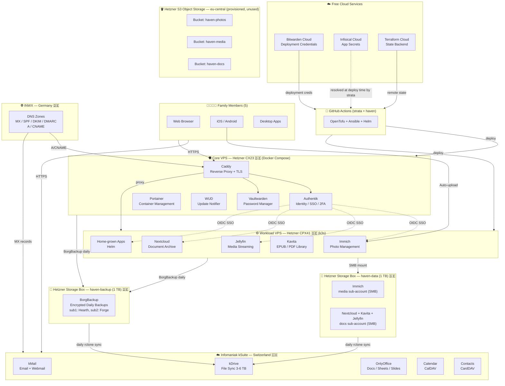

# Haven Architecture Reference

> Shared architecture documentation used by design.md and guide.md

This document describes the Haven platform infrastructure, components, and data flow. It serves as the single source of truth for:

- System topology (Hearth + Forge + storage)
- Component inventory and responsibilities
- Data durability strategy
- Provider landscape

For design rationale and decisions, see [design.md](design.md).
For deployment instructions, see [guide.md](guide.md).

---

## System Overview

Haven is a two-node family platform on Hetzner with Swiss-based file services:

```text
haven (workspace)
├── hearth (VPS — Docker Compose)          ← Core: Authentik, Vaultwarden, Caddy
│   ├── Caddy          — reverse proxy + auto-TLS
│   ├── Authentik      — SSO / identity    → auth.{domain}
│   ├── Vaultwarden    — passwords         → vault.{domain}
│   ├── Portainer      — container mgmt    → portainer.{domain}
│   └── WUD            — update notifier   → wud.{domain}
│
├── forge (VPS — k3s)                      ← Workload: Immich, Jellyfin, Nextcloud, Kavita, apps
│   ├── Immich         — photo library     → photos.{domain}
│   ├── Jellyfin       — media streaming   → media.{domain}
│   ├── Nextcloud      — document archive  → docs.{domain}
│   ├── Kavita         — EPUB/PDF library  → books.{domain}
│   └── Apps           — home-grown        → custom subdomains
│
├── storage box — haven-backup (BX11, 1 TB)   ← Hearth + Forge BorgBackup repos only
│   ├── sub1: Hearth backup (encrypted, daily)
│   └── sub2: Forge backup (encrypted, daily)
│
├── storage box — haven-data (1 TB, separate product) ← All live app data (SMB mounts)
│   ├── media sub-account: Immich
│   └── docs sub-account: Nextcloud + Kavita + Jellyfin
│
├── object storage (S3, eu-central)        ← available if a future app needs a native S3 API; not used today
│
└── cloud services (free tier)             ← Bootstrap + secrets + state
    ├── Bitwarden Cloud  — deployment credentials (API keys, SSH keys)
    ├── Infisical Cloud  — runtime application secrets
    ├── Terraform Cloud  — remote state backend
    └── GitHub           — repo + GitHub Actions CI/CD
```

---

## Architecture Diagram



---

## Component Inventory

| Layer              | Service                         | Provider                                                          | Purpose                                                                                                                                                                                                                                                                                                                                            |
| ------------------ | ------------------------------- | ----------------------------------------------------------------- | -------------------------------------------------------------------------------------------------------------------------------------------------------------------------------------------------------------------------------------------------------------------------------------------------------------------------------------------------- |
| Email              | kSuite Mail                     | Infomaniak (CH 🇨🇭)                                                 | 5 mailboxes, custom domains, alias forwarding, CalDAV/CardDAV, ActiveSync                                                                                                                                                                                                                                                                          |
| Calendar           | kSuite Calendar                 | Infomaniak (CH 🇨🇭)                                                 | Shared family calendars, delegation, CalDAV, iOS/Android sync                                                                                                                                                                                                                                                                                      |
| Contacts           | kSuite Contacts                 | Infomaniak (CH 🇨🇭)                                                 | CardDAV, vCard import/export, mobile sync                                                                                                                                                                                                                                                                                                          |
| Files              | kDrive                          | Infomaniak (CH 🇨🇭)                                                 | 3–6 TB shared storage, desktop/mobile apps, versioning                                                                                                                                                                                                                                                                                             |
| Docs               | OnlyOffice (via kDrive)         | Infomaniak (CH 🇨🇭)                                                 | Docs/Sheets/Slides in browser                                                                                                                                                                                                                                                                                                                      |
| Photos             | Immich                          | Hetzner VPS (DE 🇩🇪)                                                | Timeline, face recognition, shared albums, mobile auto-upload; library stored on the Storage Box via an SMB hostPath mount — Immich has no native S3 support, so a plain filesystem mount is the natural fit                                                                                                                                       |
| Media streaming    | Jellyfin                        | Hetzner CPX41 VPS (DE 🇩🇪)                                          | Open-source Plex alternative; no account required; OIDC via Authentik; library stored on Storage Box (SMB mount) — fixed cost, unlimited traffic, low latency, sequential reads                                                                                                                                                                    |
| Document archive   | Nextcloud                       | Hetzner CPX41 VPS (DE 🇩🇪)                                          | Family document archive/browsing layer (not the live sync drive — that's Infomaniak kDrive); OIDC via Authentik; storage on Storage Box (SMB mount), External Storage app configured against the same mount                                                                                                                                        |
| EPUB/PDF library   | Kavita                          | Hetzner CPX41 VPS (DE 🇩🇪)                                          | Reads the same shared documents tree as Nextcloud (read-only) from the Storage Box (SMB mount)                                                                                                                                                                                                                                                     |
| Object storage     | Hetzner S3 (eu-central)         | Hetzner (S3-compatible, eu-central)                               | Three buckets provisioned (`haven-photos`, `haven-media`, `haven-docs`) but **currently unused** — none of the apps above have native S3 API support, so Storage Box (SMB) serves all of them instead; kept in reserve for a future app that genuinely needs the S3 API                                                                            |
| Passwords          | Vaultwarden                     | Hetzner VPS (DE 🇩🇪)                                                | Bitwarden-compatible; same Firefox extension + iPhone app for family                                                                                                                                                                                                                                                                               |
| Deploy credentials | Bitwarden Cloud                 | bitwarden.com (☁️ free)                                            | API keys, SSH keys, tokens stored before any infrastructure exists — eliminates bootstrap problem                                                                                                                                                                                                                                                  |
| Secrets & config   | Infisical Cloud                 | app.infisical.com (☁️ free)                                        | Per-app/env secrets + key-value config; machine identities per environment; no self-hosted instance                                                                                                                                                                                                                                                |
| State backend      | Terraform Cloud                 | app.terraform.io (☁️ free)                                         | Remote Terraform/OpenTofu state; no local state files or S3 backend required                                                                                                                                                                                                                                                                       |
| Identity (SSO)     | Authentik                       | Hetzner VPS (DE 🇩🇪)                                                | OIDC/OAuth2 for all VPS services; 2FA enforcement; user lifecycle                                                                                                                                                                                                                                                                                  |
| Compute — Core     | Docker Compose                  | Hetzner CX23 VPS (DE 🇩🇪)                                           | Authentik, Vaultwarden, Caddy — stable core; deployment credentials sourced from Bitwarden Cloud; never experiments run here                                                                                                                                                                                                                       |
| Compute — Workload | k3s (single-node)               | Hetzner CPX41 VPS (DE 🇩🇪)                                          | Immich, Jellyfin, Nextcloud, Kavita, home-grown apps via Helm; expendable — destroy/rebuild freely; secrets resolved directly by strata from Infisical Cloud at deploy time (no in-cluster secrets operator)                                                                                                                                       |
| IaC — tool         | strata (Python CLI)             | [`huybrechtsxyz/strata`](https://github.com/huybrechtsxyz/strata) | Own Terragrunt alternative; orchestrates OpenTofu + Ansible against `haven` config                                                                                                                                                                                                                                                                 |
| IaC — config       | haven (config repo)             | [`huybrechtsxyz/haven`](https://github.com/huybrechtsxyz/haven)   | All infra + app declarations: OpenTofu .tf, Ansible vars, Docker Compose, Helm values                                                                                                                                                                                                                                                              |
| Reverse proxy      | Caddy                           | Hetzner VPS (DE 🇩🇪)                                                | Automatic Let's Encrypt TLS, HSTS, subdomain routing                                                                                                                                                                                                                                                                                               |
| Backups            | Two-tier backups                | Hetzner + Infomaniak                                              | **Tier 1:** Hearth + Forge system state (configs, DB dumps) via BorgBackup → the dedicated `haven-backup` Storage Box (1 TB, daily, encrypted — separate product from `haven-data`). **Tier 2:** both Storage Boxes (`haven-backup` + `haven-data`) synced to dedicated Infomaniak kDrive 3 TB once a day via rclone — offsite cross-provider copy |
| Monitoring         | Healthchecks.io + UptimeRobot   | External (free tiers)                                             | Healthchecks.io: BorgBackup dead-man's switch; UptimeRobot: public endpoint availability. A per-service health dashboard (e.g. Gatus) is not yet built                                                                                                                                                                                             |
| DNS registration   | INWX                            | INWX (DE 🇩🇪)                                                       | Domain registration for active domains                                                                                                                                                                                                                                                                                                             |
| DNS hosting        | INWX built-in NS                | INWX (DE 🇩🇪)                                                       | MX, SPF, DKIM, DMARC, A/CNAME records per domain                                                                                                                                                                                                                                                                                                   |
| Container mgmt     | Portainer                       | Hetzner VPS (DE 🇩🇪)                                                | Web UI for Docker Compose container management and monitoring                                                                                                                                                                                                                                                                                      |
| Update notifier    | WUD                             | Hetzner VPS (DE 🇩🇪)                                                | Watches for container image updates; notifies of newer versions available                                                                                                                                                                                                                                                                          |
| Cert management    | cert-manager                    | Hetzner CPX41 VPS (DE 🇩🇪)                                          | Kubernetes-native Let's Encrypt integration; automatic renewal; ACME challenges                                                                                                                                                                                                                                                                    |
| Deployment         | strata (via GitHub Actions)     | Runs from CI, targets Forge over an SSH tunnel                    | `strata deploy run` drives `helm upgrade --install` per module declared in `haven`'s config; not GitOps/sync-based (ArgoCD/Flux were considered and deliberately deferred as overkill for a single-node family cluster)                                                                                                                            |
| Secrets resolution | strata (Infisical Cloud client) | Runs from CI                                                      | Resolves `${TOKEN}` placeholders against Infisical Cloud and injects real values via `helm --set-string` at deploy time — no in-cluster secrets operator/CRDs; secrets never touch git or disk between resolution and use                                                                                                                          |

---

## Network & Firewall

- **Private network:** Hetzner vLAN connects Hearth and Forge for internal communication (backups, container pulls, API traffic)
- **Public endpoints:** Only Caddy reverse proxy (port 443) and k3s ingress (port 443) are publicly exposed via DNS
- **SSH access:** Restricted to private network only; no public SSH endpoints
- **Firewall strategy:** Deny-all default on both nodes; explicit allow rules for outbound (package management, image pulls, backup, SMB, external APIs) and inbound (loopback, private network services)
- **Certificates:** Caddy auto-renews via Let's Encrypt on Hearth; cert-manager + Let's Encrypt on Forge for ingress

---

## Public Endpoints (Family-Facing URLs)

| Subdomain            | Service         | Node       | Authentication                                               | Purpose                                        |
| -------------------- | --------------- | ---------- | ------------------------------------------------------------ | ---------------------------------------------- |
| `{domain}`           | kSuite services | Infomaniak | N/A                                                          | Email, calendar, contacts, files, docs         |
| `auth.{domain}`      | Authentik       | Hearth     | N/A (identity provider)                                      | SSO / OIDC provider; 2FA enrollment            |
| `vault.{domain}`     | Vaultwarden     | Hearth     | Bitwarden extension                                          | Password manager                               |
| `portainer.{domain}` | Portainer       | Hearth     | Local (by design — must stay reachable if Authentik is down) | Docker Compose container management UI         |
| `wud.{domain}`       | WUD             | Hearth     | Authentik OIDC                                               | Container image update notifications           |
| app.infisical.com    | Infisical Cloud | ☁️ Cloud    | Infisical account                                            | Application secrets management (cloud-hosted)  |
| app.terraform.io     | Terraform Cloud | ☁️ Cloud    | Terraform account                                            | Remote state backend (cloud-hosted)            |
| `photos.{domain}`    | Immich          | Forge      | Authentik OIDC                                               | Photo library, face recognition, shared albums |
| `media.{domain}`     | Jellyfin        | Forge      | Authentik OIDC                                               | Media streaming                                |
| `docs.{domain}`      | Nextcloud       | Forge      | Authentik OIDC                                               | Document archive/browsing layer                |
| `books.{domain}`     | Kavita          | Forge      | Authentik OIDC (native)                                      | EPUB/PDF library                               |

---

## Data Durability Model

Two-tier backup strategy — all data lives on one of two dedicated Storage Boxes first, then syncs offsite to Infomaniak kDrive:

```
Tier 1 — Daily BorgBackup (Hetzner-internal, fast)
  Hearth (Docker state, DB volumes, config)  ──┐
  Forge  (k3s state, app volumes, config)    ──┤──► haven-backup Storage Box (1 TB)
                                                     (sub1: Hearth, sub2: Forge — encrypted Borg repos)

Always-on primary storage (SMB mount, not a backup — the live data itself)
  Immich (media sub-account)                 ──┐
  Nextcloud + Kavita + Jellyfin (docs sub-account) ──┘──► haven-data Storage Box (1 TB, separate product)

Tier 2 — Daily offsite sync (rclone, ~03:00 UTC)
  haven-backup Storage Box (all contents)    ──┐
  haven-data Storage Box (all contents)      ──┘──► Infomaniak kDrive (3 TB)
                                                     cross-provider, Swiss datacentre
```

**Design principles:**

- The Forge cluster is treated as **ephemeral compute**: destroying and rebuilding it must not cause data loss.
- All primary data (Immich, Jellyfin, Nextcloud, Kavita) lives on the **`haven-data` Hetzner Storage Box** via SMB hostPath mounts, split into two sub-accounts by data type (`media` for Immich+Jellyfin, `docs` for Nextcloud+Kavita) — none of these apps have native S3 support, so a plain filesystem mount is both simpler and cheaper (unlimited traffic, no per-GB egress) than an S3/FUSE layer.
- Backups live on a **separate** `haven-backup` Storage Box, not mixed with live data — Storage Box billing is per-box/fixed-tier, and backups vs. live media/documents have very different growth curves, so keeping them on separate boxes lets each scale to its own cheapest-fitting tier independently.
- Three S3-compatible buckets (`haven-photos`, `haven-media`, `haven-docs`) are provisioned but **currently unused** — kept in reserve for a future app that genuinely needs the S3 API (public URLs, bucket policies, etc.), not for general file storage.
- Both Storage Boxes sync to kDrive daily; the Borg archive and all live app data both land offsite within the same 24h window.
- Provider separation: primary on Hetzner (VPS compute + 2 Storage Boxes), offsite copy on Infomaniak (Swiss jurisdiction).

---

## Node Specifications

### Node 1 — Core VPS (Docker Compose) 🛡️

Runs identity and secrets infrastructure. Boring by design — deployed once, never used as a playground. If this node is healthy, you can always recover everything else.

| Spec          | Value                                                                   |
| ------------- | ----------------------------------------------------------------------- |
| Model         | Hetzner CX23                                                            |
| vCPU          | 2                                                                       |
| RAM           | 4 GB                                                                    |
| SSD           | 40 GB                                                                   |
| Network       | 20 TB/mo included                                                       |
| Orchestration | Docker Compose + systemd                                                |
| Services      | Caddy, Authentik, Vaultwarden, Portainer, WUD                           |
| Cost          | ~€4/mo                                                                  |
| IaC secrets   | **Bitwarden Cloud** (deployment credentials stored before infra exists) |

**Bootstrap sequence:**

1. Operator stores deployment credentials (Hetzner API key, SSH key, DNS token) in **Bitwarden Cloud** (free tier) — no prior infrastructure required
2. Operator loads those credentials into GitHub Actions secrets (one-time, from Bitwarden Cloud)
3. GitHub Actions provisions the CX23 via OpenTofu (state in **Terraform Cloud**) and runs Ansible
4. Ansible deploys Docker Compose stack: Caddy → Authentik → Vaultwarden
5. Runtime application secrets come from **Infisical Cloud** — no self-hosted secrets service to bootstrap

### Node 2 — Workload VPS (k3s) ⚙️

Runs all family apps. Can be destroyed and rebuilt at any time without affecting core auth or passwords.

| Spec          | Value                                                                                        |
| ------------- | -------------------------------------------------------------------------------------------- |
| Model         | Hetzner CPX41                                                                                |
| vCPU          | 8                                                                                            |
| RAM           | 16 GB                                                                                        |
| SSD           | 240 GB                                                                                       |
| Network       | 20 TB/mo included                                                                            |
| Orchestration | k3s (single-node) + Helm + cert-manager                                                      |
| Services      | Immich (photos), Jellyfin (media), Nextcloud (documents), Kavita (EPUB/PDF), home-grown apps |
| Cost          | ~€26/mo                                                                                      |
| IaC secrets   | **Infisical Cloud** — resolved directly by strata from GitHub Actions at deploy time         |

**Secrets flow on Workload VPS:**

- GitHub Actions gives strata a short-lived Infisical Cloud machine-identity token for the deploy job only
- strata resolves every `${TOKEN}` placeholder declared in a module's config against Infisical Cloud and injects the real value via `helm --set-string` at deploy time — no secrets operator/CRD runs inside the cluster
- No secrets stored in git, no plain env files, and no standing in-cluster credential store; Infisical Cloud is available before and independent of the VPS

| Comparison point | Core VPS (Docker Compose)                                | Workload VPS (k3s)                                      |
| ---------------- | -------------------------------------------------------- | ------------------------------------------------------- |
| Services         | Caddy, Authentik, Vaultwarden, Portainer, WUD            | Immich, Jellyfin, Nextcloud, Kavita, apps, cert-manager |
| Stability goal   | Never breaks                                             | Expendable — rebuild freely                             |
| Secrets source   | Bitwarden Cloud (deploy creds) → Infisical Cloud runtime | Infisical Cloud, resolved by strata at deploy time      |
| Upgrade strategy | `docker compose pull && up -d`                           | `helm upgrade`, rolling restarts                        |
| Rollback         | Manual (image tags in Compose)                           | `helm rollback`                                         |
| Multi-node later | n/a                                                      | Easy — add CPX31 worker node                            |
| Cert management  | Caddy auto-TLS                                           | cert-manager + Let's Encrypt                            |
| Cost             | ~€4/mo                                                   | ~€26/mo                                                 |

---

## Cost Summary

| Component                                                                      |                          Monthly Cost |
| ------------------------------------------------------------------------------ | ------------------------------------: |
| Hearth VPS (CX23)                                                              |                                ~€4.00 |
| Forge VPS (CPX41)                                                              |                               ~€26.00 |
| Storage Box — `haven-backup` (1 TB) — Hearth + Forge Borg repos only           |                           ~€3.20–3.81 |
| Storage Box — `haven-data` (1 TB) — Immich/Jellyfin/Nextcloud/Kavita live data |                           ~€3.20–3.81 |
| Object Storage (3 buckets provisioned, unused)                                 | ~€0 (empty buckets bill near-nothing) |
| Infomaniak kDrive (3–6 TB offsite backup)                                      |                ~€3–8 (varies by tier) |
| DNS (INWX)                                                                     |                                ~€0.50 |
| **Total**                                                                      |                        **~€40–46/mo** |

*Note: Costs are approximate and based on 2026 pricing. kDrive scales with data volume; either Storage Box may need to move to a larger fixed tier (5/10/20 TB) independently as its own contents grow — splitting backups from live data means the (slow-growing) backup box won't be forced into a bigger tier just because the (faster-growing) data box needs one.*

---

## Infrastructure as Code

| Tool       | Role                                                                                                                          | Repo                                                              |
| ---------- | ----------------------------------------------------------------------------------------------------------------------------- | ----------------------------------------------------------------- |
| **strata** | Python CLI — orchestrates OpenTofu + Ansible + Helm runs against `haven` config                                               | [`huybrechtsxyz/strata`](https://github.com/huybrechtsxyz/strata) |
| **haven**  | Config repo — YAML-based declarations of all infra and apps (OpenTofu `.tf`, Ansible vars, Docker Compose files, Helm values) | [`huybrechtsxyz/haven`](https://github.com/huybrechtsxyz/haven)   |
